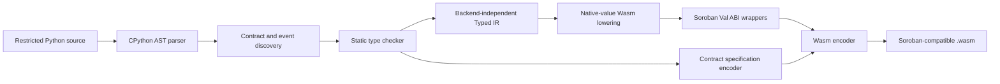

# PySoroban Architecture

## Purpose

PySoroban is a deterministic, statically typed smart-contract language for
Stellar. Contract authors write a deliberately restricted subset of Python,
which the compiler translates directly into Soroban-compatible WebAssembly.

The production artifact contains neither generated Rust nor a Python runtime.
Python is the source language and the implementation language of the compiler;
it is not an on-chain dependency.

## Design goals

- Give Python developers a small, recognizable language for Stellar contracts.
- Reject dynamic behavior before code generation.
- Produce deterministic Wasm without Cargo, rustc, or an external Wasm compiler.
- Generate the Soroban contract specification and environment metadata expected
  by Stellar tooling.
- Keep the typed middle-end independent of both Python syntax and the Wasm
  encoder.
- Make every supported feature testable at the Typed IR, Wasm, and Stellar
  network boundaries.

PySoroban is not intended to execute arbitrary Python, preserve CPython
semantics, or place an interpreter on-chain.

## Compilation pipeline

Compilation never imports or executes the contract source. The source is
parsed as data, validated, lowered into typed operations, and encoded.

## Compiler components

| Component | Responsibility |
| --- | --- |
| `frontend.py` | Parse decorators and annotations, define the supported Python subset, and statically type-check statements and expressions. |
| `model.py` | Represent checked contracts, functions, parameters, events, and contract types. |
| `lowering.py` | Remove Python syntax and lower checked AST nodes into backend-independent Typed IR. |
| `ir.py` | Define typed constants, locals, arithmetic, control flow, and explicit Soroban host operations. |
| `wasm.py` | Allocate Wasm locals, marshal Soroban `Val` values, select host imports, and encode a deterministic Wasm module. |
| `xdr.py` | Encode the Soroban environment metadata and contract specification custom sections. |
| `artifact.py` | Inspect and structurally validate generated Wasm and its embedded contract metadata. |
| `testing.py` | Execute Typed IR deterministically for fast contract unit tests. |
| `cli.py` | Expose source checking, compilation, inspection, validation, and reproducibility verification. |

## Type and value model

Supported scalar types are `i32`, `u32`, `i64`, `u64`, `boolean`, `Address`,
`Symbol`, `String`, and `Bytes`. Homogeneous `Vec[T]` and scalar
`Map[K, V]` types are also represented in the contract model and Soroban XDR
specification.

The Typed IR carries a type on every value-producing node. Operations such as
storage reads, vector indexing, map lookup, authorization, events, and
cross-contract invocation are explicit `HostCall` nodes rather than implicit
Python behavior. This makes backend behavior reviewable and prevents the Wasm
backend from having to infer source-language types.

Exported contract functions use Soroban's 64-bit `Val` ABI. The generated
wrapper decodes incoming `Val` values into native Wasm `i32` or `i64` values
where practical, executes the function body, and encodes the result back into a
`Val`. Soroban host objects such as addresses, strings, vectors, and maps remain
opaque handles.

## Wasm and Soroban integration

The encoder writes a WebAssembly 1 binary containing:

- `contractenvmetav0` with the targeted Stellar protocol;
- `contractspecv0` with function and event schemas;
- `contractmetav0` with deterministic compiler metadata;
- only the Soroban host imports required by the compiled operations;
- exported contract functions and linear memory.

Storage, authorization, events, collection access, and cross-contract calls
are lowered to protocol host functions. The compiler does not reimplement
ledger behavior inside the guest.

## Determinism and trust boundaries

The same source and compiler version produce byte-identical Wasm. The compiler
has no runtime dependencies and does not invoke an external compiler, linker,
package manager, or build script.

The main trust boundaries are:

1. The PySoroban frontend must reject syntax whose semantics are not defined by
   the language.
2. Typed IR lowering must preserve the checked program.
3. Wasm lowering must preserve Typed IR semantics and the Soroban `Val` ABI.
4. Embedded XDR must match the actual exported interface.
5. Stellar's host remains authoritative for ledger state, authorization,
   metering, and protocol behavior.

A compiler defect can miscompile otherwise valid source. For that reason the
current release is explicitly experimental and must not be used to control
production funds.

## Validation strategy

Validation is layered so one implementation is not treated as its own proof:

1. Frontend tests verify accepted and rejected source programs.
2. Typed IR tests verify explicit operations and types before Wasm generation.
3. The Python contract test environment verifies deterministic language
   behavior, storage, authorization, events, and linked contracts.
4. Differential tests execute the Typed IR and generated Wasm independently
   and compare their results.
5. Artifact validation checks Wasm structure, section ordering, metadata,
   imports, exports, and contract XDR.
6. Node's WebAssembly engine validates and executes generated modules.
7. Stellar CLI parses each generated interface.
8. Reference artifacts are deployed and invoked on Stellar testnet.

The test environment and miniature differential host do not claim to reproduce
the complete Soroban host. Network execution remains the integration source of
truth.

## Distribution and deployment

The compiler is distributed as a pure-Python wheel with a `pysoroban` CLI. The
same wheel is loaded by Pyodide in the public browser demo, so browser builds use
the repository's compiler rather than a TypeScript reimplementation.

Generated artifacts can be inspected, uploaded, deployed, and invoked with the
standard Stellar CLI. Deployment IDs, Wasm hashes, transactions, and verified
calls are recorded in `deployments/testnet.json`.

## Current limitations

- Only the documented restricted Python subset is accepted.
- Recursion, exceptions, floating point, reflection, dynamic imports, and
  arbitrary Python objects are excluded.
- Collection mutation and nested collection types are not yet supported.
- User-defined contract structs and enums are not yet supported.
- The compiler currently targets a single declared Stellar protocol version.
- The project has not completed an independent security audit.

These boundaries are intentional and will only be expanded together with type
rules, Typed IR semantics, Wasm differential tests, and network verification.
